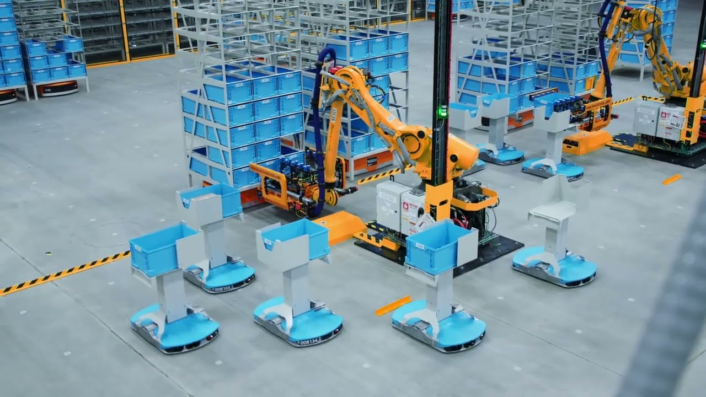

# Automated-Warehousing-using-Clingo
1. Designed and implemented an Automated Warehouse scenario using logic programming (Clingo).
2. This problem statement is taken from ASP Challenge 2019.
3. Developed a robust system to tackle all ahrd and weak constraints.
4. The model has successfully passed all dynamic world instances provided in the challenge.
5. To run from the command line: clingo clingo demo.asp inst.asp -c n=10 0
6. Optimized the model to fulfill all orders in the minimum amount of time possible.
7. This is a simplefied version of automated planning done in Amazon Warehouses.
 
